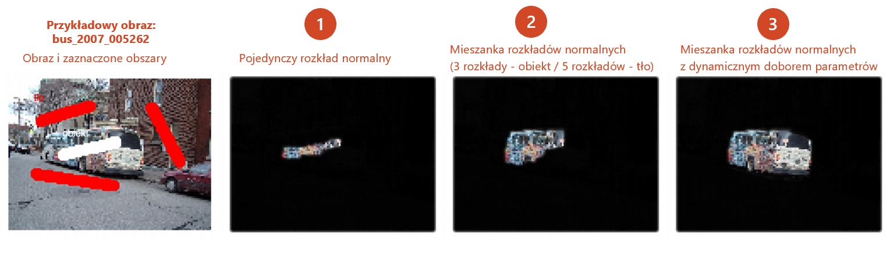

# mixedgraphcut 


## What is in the package 

This package presents new graphcut variations for interactive image segmentation as well as an Shiny app allowing user to perform a segmentation on a selected image. 

Application preview: 




## How to use the package

Launch application:
```r
mixedgraphcut::run_segmentation_app()
```
