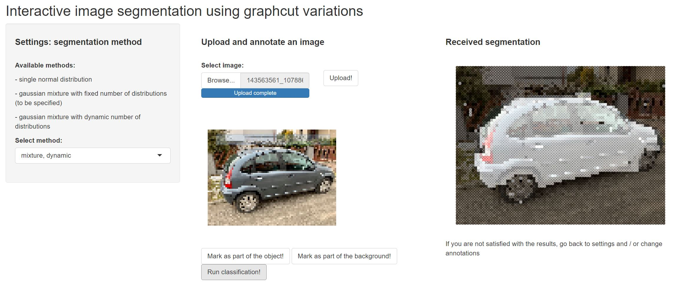

# mixedgraphcut 


## What is in the package 

This package presents new graphcut variations for interactive image segmentation as well as an Shiny app allowing user to perform a segmentation on a selected image. 

Application preview: 




Launch application:
```r
mixedgraphcut::run_segmentation_app()
```

## More details - in polish only

For more details about algorithms included in the package, follow the link:
<a href="https://github.com/MartaGajewska/mixedgraphcut/blob/master/www/Marta_Gajewska_Interaktywna_segmentacja.pdf" target="_blank">PDF.</a>
